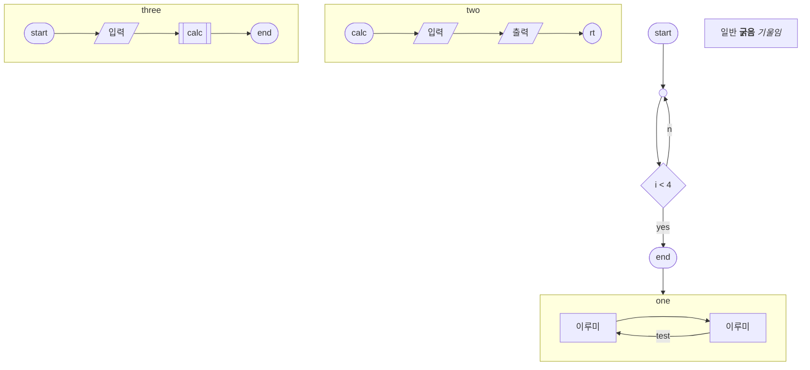

```mermaid
flowchart TD
    subgraph one
    A["이루미"]
    B["이루미"]
    A ---> B
    B --test--> A
    end

    subgraph two
    calc([calc])
    calc --> inp[/입력/]
    inp --> out[/출력/]
    out --> rt([rt])
    end

    subgraph three
    start([start]) --> inp1[/입력/]
    inp1 --> fun1[[calc]]   
    %%[[]] 는 서브루틴%%
    fun1 --> end1([end])
    end

    start1([start]) --> blank((" "))
    blank --> cond{i < 4}
    cond --no--> blank
    cond -->|yes| end2([end])
    end2 --> one

    글씨바꾸기["`일반 **굵음** *기울임*`"]
```